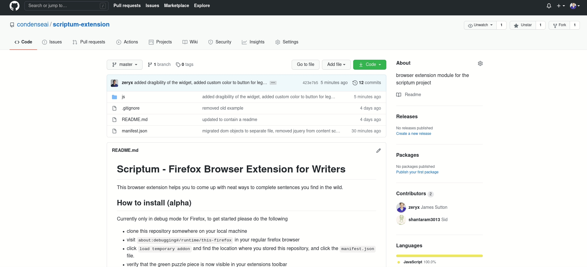

# Scriptum - Firefox Browser Extension for Writers
This browser extension helps you to come up with neat ways to complete sentences
you find in the wild. 

## How to install (alpha)
Currently only in debug mode for Firefox, to get started please do the following
- clone this repository somewhere on your local machine
- visit `about:debugging#/runtime/this-firefox` in your regular firefox browser
- click `load temporary addon` and find the location where you stored this repository, and click the `manifest.json` file.
- verify that the green puzzle piece is now visible in your extensions toolbar

## How to use
- navigate to a webpage which contains some text you want to hallucinate an alternative for
- press the green puzzle piece icon on your extension toolbar
- A blue box + a white square button should appear
- highlight the text, and press `ctrl + shift + q`
- if everything is working, the results of your query should get printed to the console
